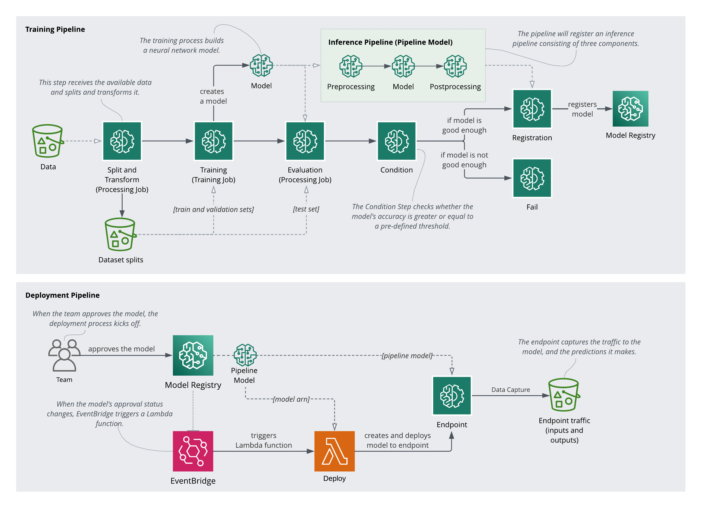

# sagemaker-dogbreeds-classification
This project implements the following in AWS Sagemaker:
- a training pipeline
- a deployment pipeline
- a data monitoring and a model monitoring schedule

Main code in `experiment.ipynb`. Other scripts are used in various Sagemaker services, e.g. training jobs, endpoints, monitoring. 

# Reference
this repo is a class project from the awesome program: [ML School program from svpino](https://github.com/svpino/ml.school)
