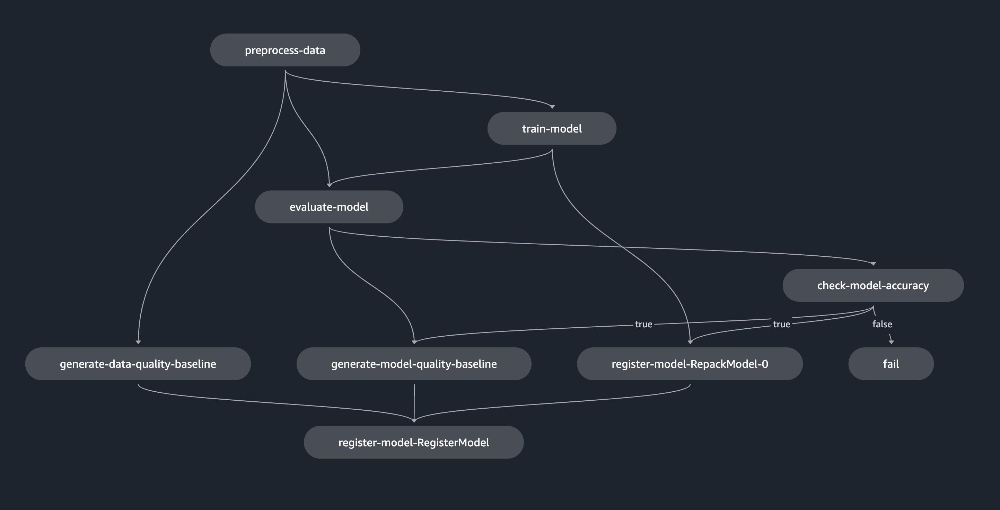

# sagemaker-dogbreeds-classification
This project implements the following in AWS Sagemaker:
- a training pipeline
- a deployment pipeline
- a data monitoring and a model monitoring schedule

The images are from [the ml.school program from Santiago](https://github.com/svpino/ml.school).
The pipeline constructed here is a bit different:
- there is no "inference pipeline", I put pre-processing and post-processing of the model in the same script using `input_fn` and `output_fn`. Necessary artifacts that should always be together with model checkpoint is directly put inside `SM_MODEL_DIR` in the training job, in this case the classes name and order of the data, but in general could be some artifacts for pre-processing transformation. 
- there is no batch transform job for generating predictions for test data, it is done in the evaluation step. As I see in evaluation step, predictions for testing data is already made, I directly save those prediction and use them as the model performance baseline for later model monitoring. 

Main code is in `pipeline.ipynb`. Other scripts are used in various AWS or Sagemaker services, e.g. training jobs, endpoints, monitoring, lambda. 
The training pipeline is deployed directly in the `.ipynb`. 

The deployment pipeline is done via AWS console UI as I don't have the permission in AWS Sagemaker correcly configured. 

The notebook can be run as is, only config to supply is the `BUCKET` environment variable. It can be put in `config.env` or `.env` (need code changes in the first 2 cells). 

For the monitoring schedule, some fake traffic and groundtruth must be generated first for any statistics to capture and show in the monitoring schedule. The last few cells demonstrated the code. 

Monitoring schedule demo: 

# Reference
this repo is a class project from the awesome program: [ML School program from Santiago](https://github.com/svpino/ml.school)
